# Tetris Javascript
In this project I have created a game to demonstrate my understanding of the concepts of *javascript* with a Tetris game. Feeling confident in my use of HTML and CSS, I thought I would challenge myself and in retrospect, may have bitten off more than I could chew.

I approached this project with mobile first design principles to create a responsive webpage that is intended to look good and and perform well on any size of device. This in its own right created some challenges especially with regard to programming touch controls, which I have yet to master.
 I have also put good user experience at the front and center of all designs and have strived to create an intuitive, informative and enjoyable journey for my users.
 
&nbsp

## User Stories
I identified 2 groups of user for this site, 
* Firstly, users that are new to tetris and looking for a fun, colourful entry level experience. 
* Secondly, experienced tetris players who are looking for a game that increases in difficulty over time testing their skill.

&nbsp

### New Users
* Should be able to quickly gain an overview of what the game is about.
* Should be able to play the game via the tetris page.
* Should be able to clearly understand the rules of the game via the instructions page.
* Should be able to gain higher levels of experience as the game progresses.
* Should be able to get clear information of what tetriminos are and how they interact with the grid.
* Should be able to identify which keys are pressed and interact with the controls on the page.

### Existing Users
* Should be able to do all the above.
* Should be able to gain an high score that is stored locally within localStorage.
* Should be able to experience a sense of nostalgia through classic tetris elements, such as the brightly coloured tetriminos and the music.
* Should be able to further expand their knowledge of the game through the various links to community sites and knowledge bases.
* Should be able to connect  with Tetris communities through the social media links provided on the site.

&nbsp

  ## Scope & Site Goals
  From the above information I was able to determine what would be of considerable value when visiting the site and from that developed the following scope and goals:

  * Create a page that has a game interface, featuring a grid that tetriminos can move down, rotate on and stack on to form complete lines.
  * Completed lines should be removed from the grid, and the users score should be incremented for every successful line cleared. Multiple clears should result in the user advancing in level.
  information regarding the players score, lines cleared and level achieved should feedback to the player in real time.
  * The player should be able to play the game with the use of arrow keys, or with a mouse by clicking on dedicated buttons.
  * The player can choose whether or not to have game music playing to add to their experience.
  * The score should increase with every successful line cleared, and the level should increase with successive line clears, resulting in bonus points be added to the score.
  * The tetriminos should be able to move left, right and down and rotate by 90 degrees. They should not be able to move beyond the grid walls and should freeze when hitting the floor or other tetriminos.
  * The player should be able to pause the game.
  * If all the tetriminos make it to the grid ceiling, the game should end.
  
    * Rather than create traditional wireframes for this project, I opted for a pen and paper approach, as it made it easier to visualize and iterate through the various functions and design elements.
        * 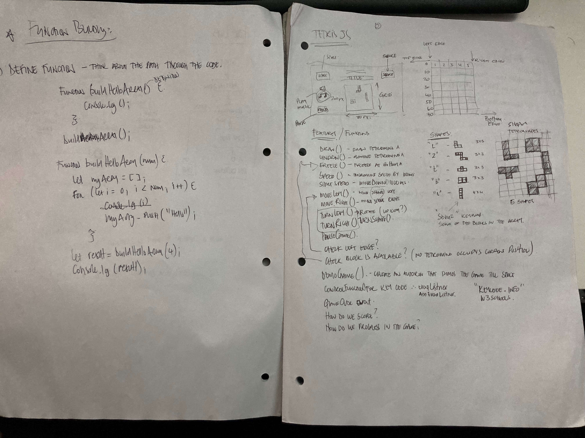
        * 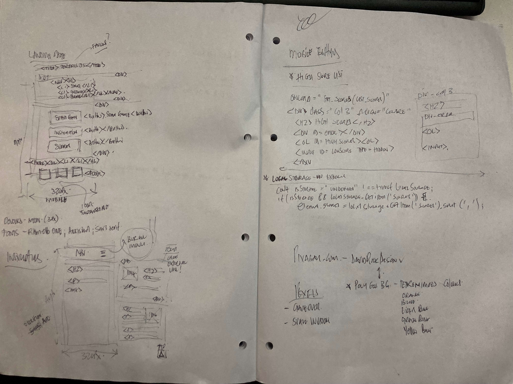
        * 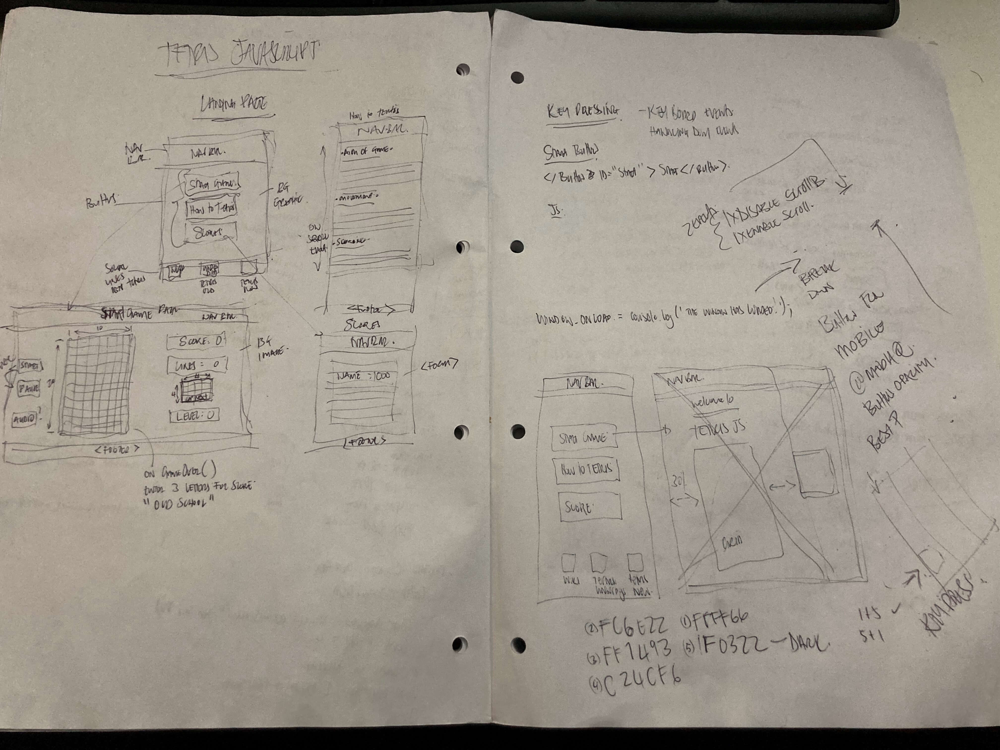
        * the Tetriminos were drawn up with the aid of an excel spreadsheet to better understand the various iterations each shape would take in the array.
        * 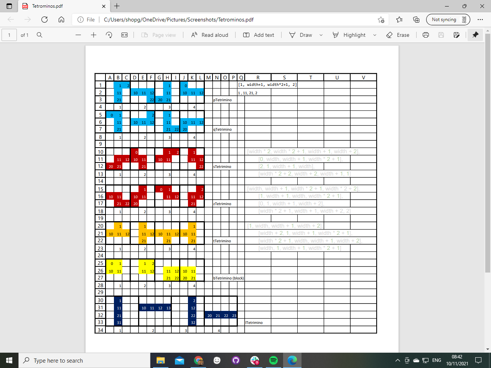

&nbsp

## Features

* ### Landing Page
    * The landing page was designed to be an eye catching page with simple navigation through buttons, to really inspire the gaming experience.
    * 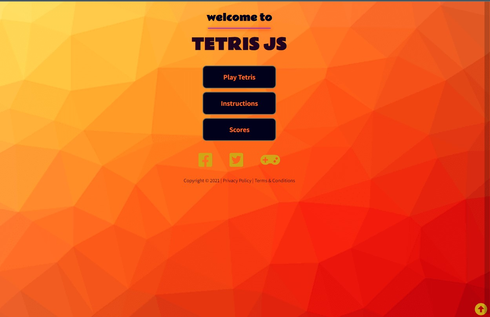
* ### Instructions Page
    * The instructions page outlines a brief history of the game, with a link to its corresponding wikipedia article. 
    * The player instructions are listed in a clear and concise manner beneath the history.
    * The is a call to action button below the instructions inviting the player to start a game,
    * 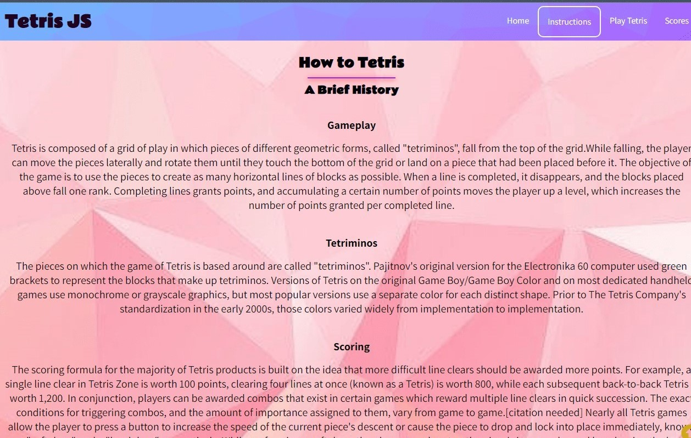
* ### Navigation Buttons
    * The navigation bar was removed from the landing page so as not hamper the fun aspect of the site, and replaced rather with a series of call to action buttons, to familiarize the user with the point and click aspect of the game.
    * 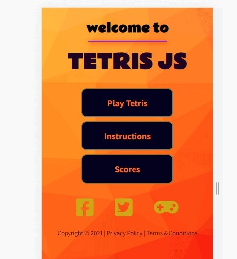
* ### Navigation Bar
    * The traditional navigation bar comes into play across the **Instructions**, **Scores** and **Tetris** gameplay pages. 
    * One of the key factors with the site is responsive design, and with the navbar this is carried through in the way in which it behaves on smaller screens, with it taking up 100% width and stacking for easier readability and an improved user experience that doesn't detract the focus away from the site.
    * With mobile in mind, a hamburger menu with a toggle dropdown replaces the standard bar so as not to monopolize screen space.
    * 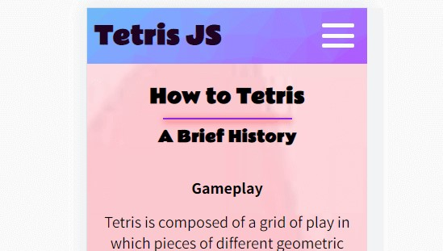
    * 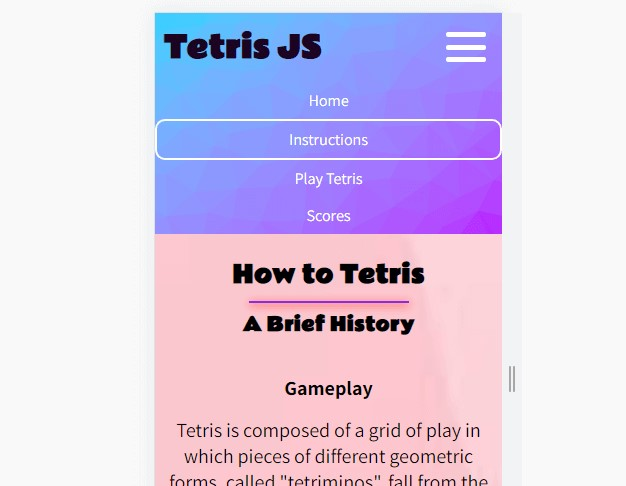
* ### Game Page
    * The game page is broken down into 3 panels.
    *  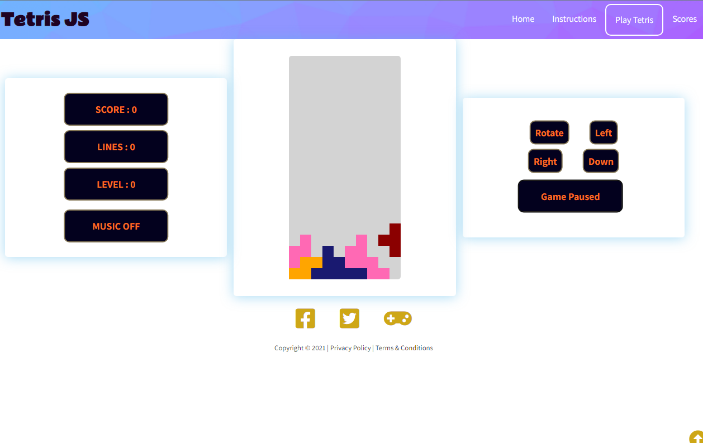
       * The first panel contains the Player information is terms of **Score, Line Cleared and Level**, as well as the button to active the game theme music,which is in an off state, **Music Off**.
    * The second panel contains the **game grid** and is central to the screen.
    * The third panel contains the controls - **Left, Rotate, Right & Down** - for point and click, and the **Start/Pause** button.
* ### Game Grid
    * The game grid was hard coded into an array and is made up of 200 divs.
* ### Controls
    *  As mentioned, the player is able to either directly use the **arrow** keys or point and click **buttons**. On mobile devices, the buttons are active to being touched.
* ### Scoring Panel 
    * The scoring panel contains player information in a descending order, being with the **Score** tallied at 15 points for every line cleared. **Lines** for the number of lines that are cleared. And finally **Level** . For every successful 5 lines cleared, 1 level is awarded with a bonus 100 points. The traditional Tetris rules offer a lot more variety in terms of scoring, but due to time constraints, I opted for a simpler scoring system.
    * 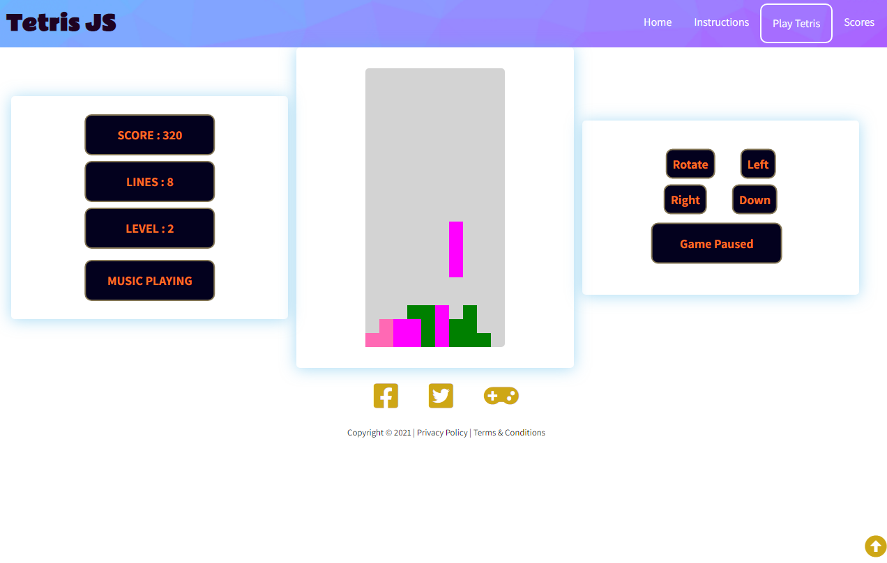
* ### Scores Page
    * The player can access the scores page either through direct navigation, or by completing a game. When a game ends, the player is taken automatically to the scores page and asked to submit their name. This data is store locally on their machine. Through a couple of call to actions, the player can either opt to play another game, which resets the game variables to 0 or navigate back to the home screen.
    * 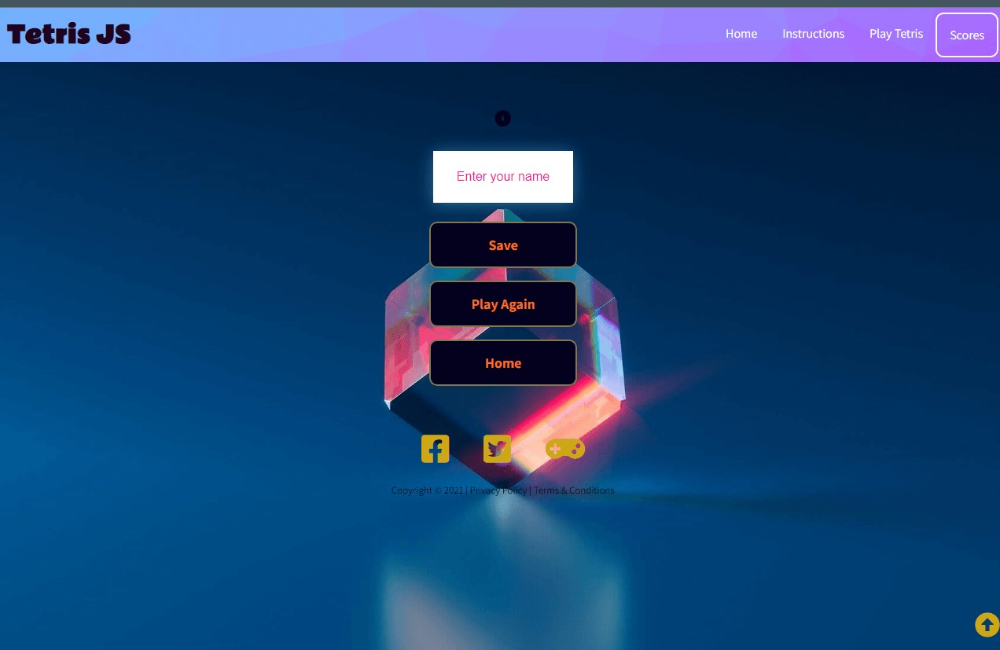
* ### Footer
    * The footer contains not only social media links, by references to other Tetris sites.
    * The player can engage with the broader Tetris community via facebook or twitter, or find out more information via the official Tetris website.
    * All links open new browser windows.
    * 
* ### External Links
    * [Facebook](https://www.facebook.com/Tetris/)
    * [Twitter](https://twitter.com/Tetris_Official)
    * [Tetris](https://tetris.com/)
 

&nbsp

 ## Future Updates
 With the complexity of the project being a little out of the scope of my own ability there were some features that did not make it into the game. These additional features would assist in creating a more engaging and challenging experience as we ll as replay-ability as players advance and hone their skill.
  * These include:
    * A demo screen that automatically loops through to offer a visual demonstration of how to play the game. On starting the game, the grid is cleared and the player can begin.
    * A difficulty setting, so as to start from a more advanced state of the game, rather than having to iterate through beginner stages.
    * A functioning mini display grid so that the player can see which Tetrimino is dropping next.
    * A larger high score screen, which is stored in the cloud offer multiple users to chase a top spot, or view fellow players top scores.
 

&nbsp

## Testing 1.0
Throughout this project I have done regular testing. And have reloaded and refreshed the pages multiple times after each addition and modification. Various bugs were found in terms of images not displaying correctly, positioning, buttons and links not working. Mostly through revision of the HTML, CSS and JS course work and some external googling I was able to squash most bugs I encountered.

A fair amount of time was spend understanding how the javascript ran, working out the game logic and implementation thereof.

My first round of testing was functionality testing in which I performed the following actions.

* Testing the Links
* Checking the External Links such as Wikipedia, Twitter and the Tetris homepage
* Checking the External Links all Open in the new Tab
* Testing Internal Links to **instructions.html**, **tetris.html** and **scores.html** , as well as the sub links such as #top, buttons and navigation elements.
* Testing the keyCodes and mouse click events
* Testing the Start/Pause Button
* Testing the Play/Mute Button
* Validator Testing
* Validating the HTML used in the site
* Validating the CSS used in the site
* Validating the JS used in the site

### Validation results - W3C Validator
All pages where tested through the W3C html validator and passed. Links to the results for each page are as follows;
* index.html Validation  [Index HTML Validator](assets/images/readme-imgs/index-html-validation.jpg)
* instructions.html Validation  [Instructions HTML Validator](assets/images/readme-imgs/instructions-html-validation.jpg)
* tetris.html Validation   [Tetris HTML Validator](assets/images/readme-imgs/tetris-html.validation.jpg)
* scores.html Validation  [Scores HTML Validator](assets/images/readme-imgs/scores-html-validation.png)

### Validating results -  JSHint Validator
All javascript was passed through the JSHint validator with ES6 included [JS Validator](assets/images/readme-imgs/jsHint-validator.png)

### Validation results - CSS Validator
All pages where tested through the W3C css validator and passed. Links to the results for each page are as follows;
tetris-javascript Validation  [CSS Validator](assets/images/readme-imgs/css-validation.jpg)
Site fluidity
To test the flow of the site I forwarded it on to my spouse and work colleagues. Grammarly was also used to test the various pages for any spelling and grammar errors.

### Browser Compatibility
I tested the compatibility of my site first by by emulating different devices using the Dev tools in Chrome as well as using the variable responsive setting to check at different breakpoints.

The various tests that were run were:
* checking to see if the all images and buttons and panels scaled and maintained aspect ratio as the display shrunk and grew.
* checking to see if responsive elements within my layout changed at the correct breakpoints, such as the navbar and toggle.
* checking to see if my media queries behaved as expected with regards to navigation toggle displaying in rows when in mobile navigation.
* I then tested it on different browsers. I have tested in Chrome, Firefox and Edge. Once I was sure my project worked on windows 10, I then opened it on my phone running Safari on IOS 15.

&nbsp

### Testing 2.0
My second round of testing involved accessibility and readability, checking the live site against various industry standards such as Eightshapes and Webaim to ensure a well thought out UX and UI.

### Contrast Checker
The first port of call with regards to contrast was Eightshapes Contrast Grid so as to best understand the contrast between all the elements of the site, ensure fonts were readable against backgrounds and that font sizing was consistent to maintain accessibility.

The site was tested using A11y colour contrast accessibility checker Contrast Checker to ensure maximum readability and accessibility.
### A11y - 
The site was tested using WAVE, web accessibility evaluation tool Webaim to ensure accessibility criteria were met.
 * Contrast Checker Scores [A11y Contrast Score](assets/images/readme-imgs/a11y-contrast-checker.jpg)
### Lighthouse Scores
The site was tested for both mobile and desktop scores via Google Lighthouse with multiple tests being conducted.
* index.html Lighthouse  [Index Lighthouse Score](assets/images/readme-imgs/index-html-lh.png)
* instructions.html Lighthouse [Instructions Lighthouse Score](assets/images/readme-imgs/instructions-html-lh.png)
* tetris.html Lighthouse [Tetris Lighthouse Score](assets/images/readme-imgs/tetris-html-lh.png)
* scores.html Lighthouse [Scores Lighthouse Score](assets/images/readme-imgs/scores-html-lh.png)
  * For the most part pages consistently scored 100 for accessibility and SEO and upper 90's for performance and best practices.
### AmIResponsive
The site was tested with the amireponsive tool to determine how well it would look on various outputs.
 *  AmIReponsive
   * 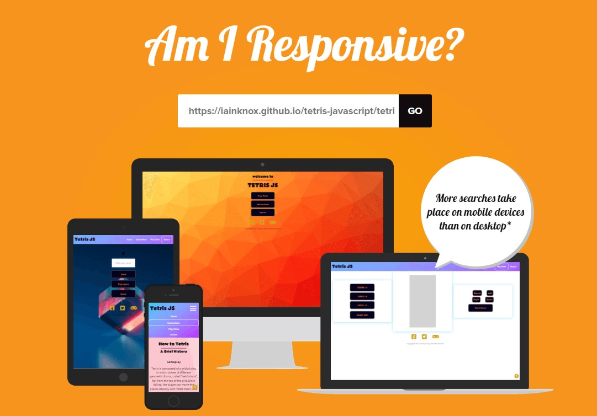
 

&nbsp

## Deployment
I have hosted my site on github pages, it can be accessed from the following url:
[Tetris Javascript](https://iainknox.github.io/tetris-javascript/) 

The deployment process was done via GitHub Pages. From the Github Pages tab, I followed these steps to ensure the site was live:
 * Ensured that the **main** branch was selected as the **source**  from which it was built.
 *  I then selected **save** at which point Github alerted me that the site was ready to be published at the provided address(linked above).
 * When clicking on the link, a new browser window was opened and the live site was made available.
    * [Github Deployment](assets/images/readme-imgs/github-deployment.png)

&nbsp

 

## Credits
A big shout out to my mentor, **Cans Sucullu** for guiding me through the process and helping me thrash out the scope. Always quick to point me in the right direction, offering assistance when necessary.

I was also fortunate to have be aided by mentor, **Reuben Ferrante** who provided countless points of reference.

The community on Slack, the help and feedback a student is able to receive from the peers and alumni is a really invaluable tool to have.

Both James Quick's and Michael Karen's various articles and tutorials on **Local Storage** and creating a **high scores list**  [Learn Build Teach](https://discord.com/invite/vM2bagU) and Tetris builds [Learning Modern Javascript with Tetris](https://michael-karen.medium.com/learning-modern-javascript-with-tetris-92d532bcd057)

&nbsp

 

## Content
Much of the information regarding Tetris, its styles and origins where taken from various wikipedia articles, old gaming sites:

Link to the Tetris wiki, full of inspiration [Tetris Wiki](https://en.wikipedia.org/wiki/Tetris)

* The color was inspired by the old school bright neon colours and running various searches through google with the keyword Tetris and then further refined with the help of sites such as Color Space and Coolors

* The fonts were acquired via [Google Fonts](https://fonts.google.com/)

 

&nbsp

## Media
The images used throughout the site were sourced from an open source gallery in Pixabay 

Icons used throughout the site for social media and card graphics were sourced from the free kit made available on Font Awesome

 

&nbsp

## Other Resources
To better add to my understanding, markdown syntax was researched from Markdown Syntax to aid in compiling and styling this README document :)

While most programming happened at unsociable hours, when I really got stuck the web is an invaluable resource too, I did a fair amount of review on W3 Schools, MDN Mozilla. As I often felt like I was traversing an alien world, I got my hands on reference books such as Javascript and JQuery: Interactive Front-End Web Development by Jon Duckett, Javascript: The Good Parts by Douglas Crockford and Eloquent Javascript, 3rd Edition by Marijn Haverbeke. 

&nbsp

 